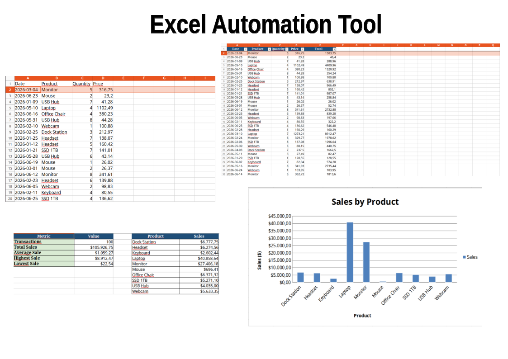

# Excel Automation Tool



A professional Python automation solution that processes Excel files, validates business data, removes errors, and generates structured reports with automated summaries and visualizations.

This project demonstrates how repetitive spreadsheet workflows can be transformed into reliable automation processes that reduce manual work, improve data accuracy, and save business time.

---

# Overview

Many businesses spend hours every week manually cleaning spreadsheets, validating information, and preparing reports.

This tool automates that workflow by:

* Reading Excel files automatically.
* Validating business data.
* Removing invalid records.
* Processing and transforming information.
* Calculating business metrics.
* Generating professional Excel reports.
* Creating dashboards and charts.

---

# Problem

Manual spreadsheet processing can lead to:

* Time-consuming repetitive tasks.
* Human errors during data cleaning.
* Inconsistent reports.
* Difficulties maintaining recurring workflows.

---

# Solution

This automation tool provides a reusable workflow that transforms raw Excel files into clean, validated, and business-ready reports.

The system automatically:

1. Reads input Excel files.
2. Validates required fields.
3. Removes invalid records.
4. Calculates derived values.
5. Generates formatted Excel reports.
6. Creates summary dashboards.

---

# Features

## Excel Data Processing

* Import Excel files automatically.
* Validate spreadsheet structure.
* Detect missing information.
* Remove invalid records.
* Calculate transaction totals.
* Process business datasets.

---

## Data Validation

The system validates:

* Missing products.
* Empty quantities.
* Invalid prices.
* Negative values.
* Required spreadsheet fields.

---

## Automated Excel Reports

The generated report contains:

## Processed Data Sheet

Includes:

* Cleaned records.
* Calculated totals.
* Formatted Excel table.
* Frozen headers.
* Automatic column sizing.

---

## Sales Dashboard

Includes:

* Total transactions.
* Total sales.
* Average sale value.
* Highest sale.
* Lowest sale.
* Sales by product visualization.

---

# Architecture

The project follows a modular Python architecture:

```text
excel-automation-tool/

├── src/
│   ├── main.py
│   ├── generate_sample_data.py
│   ├── processor.py
│   ├── validator.py
│   ├── reporter.py
│   └── utils.py
│
├── tests/
│   ├── test_validator.py
│   └── test_processor.py
│
├── data/
│   ├── input/
│   └── output/
│
├── screenshots/
│
├── Dockerfile
├── docker-compose.yml
├── Makefile
├── requirements.txt
└── README.md
```

---

# Workflow

The automation pipeline works as follows:

```text
Excel Input File

        |
        v

Data Validation

        |
        v

Data Processing

        |
        v

Business Calculations

        |
        v

Excel Report Generation

        |
        v

Dashboard and Visualization
```

---

# Technologies

* Python 3.12
* Pandas
* OpenPyXL
* Pytest
* Excel Automation
* Data Processing
* Data Validation
* Logging
* Docker

---

# Installation

Clone the repository:

```bash
git clone <repository-url>

cd excel-automation-tool
```

Create a virtual environment:

```bash
python3 -m venv .venv
```

Activate environment:

Linux:

```bash
source .venv/bin/activate
```

Install dependencies:

```bash
pip install -r requirements-dev.txt
```

---

# Generate Sample Data

The project includes a script that generates a realistic Excel dataset.

Run:

```bash
make sample
```

Generated file:

```text
data/input/sales.xlsx
```

The generated dataset contains sample business transactions with validation cases.

---

# Run Application

Execute:

```bash
make run
```

or manually:

```bash
python -m src.main \
--input data/input/sales.xlsx \
--output data/output/report.xlsx
```

Generated report:

```text
data/output/report.xlsx
```

---

# Docker Usage

Build and run the application:

```bash
make docker
```

The container will:

* Load the input Excel file.
* Process the data.
* Generate the final report.

Output:

```text
data/output/report.xlsx
```

---

# Testing

The project includes automated tests using Pytest.

Run:

```bash
make test
```

Expected result:

```text
2 passed
```

Tests validate:

* Data cleaning rules.
* Excel processing logic.
* Calculation accuracy.

---

# Logging

Application execution logs are stored in:

```text
logs/app.log
```

Example:

```text
INFO | Reading Excel file
INFO | Removed invalid rows
INFO | Report generated successfully
```

---

# Screenshots

The project includes screenshots showing:

* Input Excel data.
* Processed data.
* Dashboard summary.
* Generated charts.
* Terminal execution.

---

# Use Cases

This solution can be adapted for:

* Sales report automation.
* Inventory processing.
* Financial spreadsheets.
* Customer data cleaning.
* Business reporting workflows.
* Recurring Excel processes.

---

# Future Improvements

Possible extensions:

* Database integration.
* REST API integration.
* Scheduled automation.
* Email report delivery.
* Cloud deployment.
* Web dashboard.
* AI-powered data analysis.

---

# Skills Demonstrated

* Python Automation
* Excel Automation
* Pandas
* OpenPyXL
* Data Processing
* Data Validation
* Report Generation
* Automated Testing
* Docker
* Clean Code Practices

---

# Author

Python Automation Developer

Specialized in:

* Python automation solutions.
* API integrations.
* Backend development.
* Data processing workflows.
* Business process automation.
